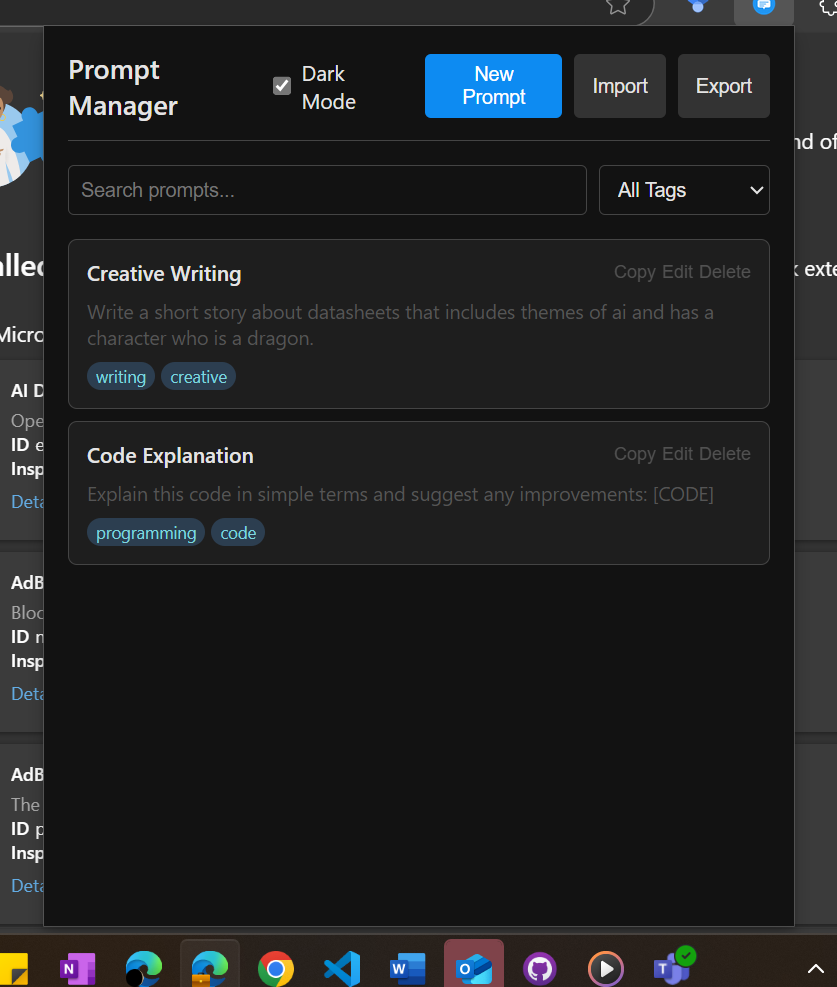

# Prompt Manager Chrome Extension

A powerful Chrome extension for managing, organizing, and retrieving AI prompts with advanced search and NLP capabilities.



## Features

### Core Functionality
- **Create and Edit Prompts**: Easily create, edit, and delete prompts in your library
- **Tagging System**: Organize prompts with customizable tags
- **Copy to Clipboard**: One-click copying of prompts for use in AI tools
- **Import/Export**: Share your prompt library via JSON files
- **Dark Mode**: Toggle between light and dark themes

### Advanced Search
- **Full-text Search**: Search through titles and content
- **Fuzzy Matching**: Find prompts even with typos or partial matches
- **Advanced Filters**: Filter by tags, date ranges, and more
- **Search History**: Track and quickly access your recent searches
- **Search Suggestions**: Get intelligent suggestions as you type

### NLP Features
- **Automatic Tag Suggestions**: AI-powered tag recommendations based on prompt content
- **Sentiment Analysis**: Automatically detect the sentiment of your prompts
- **Intent Classification**: Identify the purpose of your prompts (question, instruction, creative, etc.)
- **Similar Prompt Detection**: Find related prompts in your library

## Installation

### From Source (Developer Mode)
1. Clone this repository or download the source code
   ```
   git clone https://github.com/yourusername/prompt-manager.git
   ```

2. Open Chrome and navigate to `chrome://extensions/`

3. Enable "Developer mode" (toggle in the top-right corner)

4. Click "Load unpacked" and select the `prompt_manager` directory

5. The Prompt Manager icon should now appear in your browser toolbar

### From Chrome Web Store (Coming Soon)
1. Visit the [Chrome Web Store page](#) (link will be available when published)
2. Click "Add to Chrome"
3. Confirm the installation

## Usage

### Basic Usage

1. **Creating Prompts**
   - Click the Prompt Manager icon in your browser toolbar
   - Click "New Prompt"
   - Enter a title, content, and tags (comma-separated)
   - Click "Save"

2. **Finding Prompts**
   - Use the search bar to find prompts by title or content
   - Filter by tags using the dropdown
   - Sort results by relevance, date, or title

3. **Using Prompts**
   - Click the "Copy" button on any prompt to copy its content to your clipboard
   - Paste the prompt into your favorite AI tool

### Advanced Features

1. **Advanced Search**
   - Click the "Advanced" button next to the search bar
   - Choose search options:
     - Fuzzy Search: Match similar terms
     - Search in Titles/Content: Specify where to search
     - Date Range: Filter by creation date
     - Tags: Select multiple tags to filter by

2. **NLP Tools**
   - When creating or editing a prompt, click "Suggest Tags" to get AI-recommended tags
   - View sentiment analysis and intent classification for your prompts
   - Click "Similar" on any prompt to find related prompts in your library

3. **Import/Export**
   - Click "Export" to save your entire prompt library as a JSON file
   - Click "Import" to load prompts from a previously exported JSON file

## Data Storage

All your prompts are stored locally in your browser using Chrome's Storage API. This means:

- Your data stays on your computer and is not sent to any servers
- Your prompts will persist between browser sessions
- You can transfer your data between computers using the Export/Import feature

## Project Structure

```
prompt_manager/
├── icons/
│   ├── icon16.png
│   ├── icon48.png
│   └── icon128.png
├── manifest.json      # Extension configuration
├── popup.html         # Main UI
├── styles.css         # Styling
├── popup.js           # Main functionality
├── background.js      # Background processes
├── search.js          # Advanced search functionality
├── nlp.js             # Natural language processing features
└── README.md          # Documentation
```

## Development

### Modifying the Extension

1. Make your changes to the source code
2. Reload the extension in `chrome://extensions/` by clicking the refresh icon
3. Test your changes

### Building for Production

To create a distributable version of the extension:

1. Zip the contents of the `prompt_manager` directory
   ```
   cd prompt_manager
   zip -r ../prompt-manager.zip *
   ```

2. This zip file can be uploaded to the Chrome Web Store Developer Dashboard

## Future Enhancements

- **Cloud Sync**: Synchronize your prompt library across devices
- **Prompt Templates**: Create templates with variable placeholders
- **Usage Analytics**: Track which prompts you use most frequently
- **Response Management**: Store AI responses alongside prompts
- **Collaboration Features**: Share prompts with team members

## License

This project is licensed under the MIT License - see the LICENSE file for details.

## Contributing

Contributions are welcome! Please feel free to submit a Pull Request.

1. Fork the repository
2. Create your feature branch (`git checkout -b feature/amazing-feature`)
3. Commit your changes (`git commit -m 'Add some amazing feature'`)
4. Push to the branch (`git push origin feature/amazing-feature`)
5. Open a Pull Request

## Contact

- GitHub: [Your GitHub Profile](https://github.com/yourusername)
- Twitter: [@YourTwitter](https://twitter.com/yourtwitter)
- Email: your.email@example.com

## Acknowledgments

- Icons provided by [Google Material Icons](https://material.io/resources/icons/)
- NLP algorithms inspired by [Natural](https://github.com/NaturalNode/natural)
